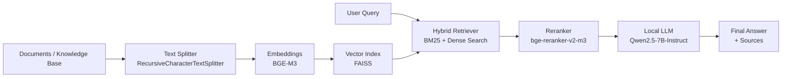

# 🧠 RAG-QA

A **local Retrieval-Augmented Generation (RAG)** question answering system that enables efficient answers based on a custom knowledge base.

The entire pipeline — including the **LLM, embeddings, and retrieval system — runs locally on your machine**.

✅ **No external APIs**
✅ **No cloud dependencies**
✅ **Your data never leaves your system**

This makes the project suitable for:

* privacy-sensitive environments
* offline usage
* research and experimentation with local LLM pipelines

---

# 🚀 Quick Overview

**Main capabilities**

* 🧠 **Fully local LLM inference**
* 📚 Retrieval-Augmented Generation (RAG)
* 🔎 Hybrid retrieval (**BM25 + embeddings**)
* 📑 Answer generation with **source citations**
* ⚡ Optimized vector search using **FAISS**
* 🎯 Retrieval quality improved with **reranking**
* 🔒 **Private and offline by design**

All components operate **entirely on the user's machine**.

---

# 💻 Requirements

## Hardware

Recommended minimal configuration for smooth performance:

| Component | Recommended               |
| --------- | ------------------------- |
| GPU       | **24 GB VRAM**            |
| RAM       | **16 GB RAM**             |
| CPU mode  | **32 GB RAM recommended** |

The system **can run entirely on CPU**, but GPU acceleration significantly improves performance.

Since the **LLM runs locally**, hardware resources determine performance.

---

# ⚡ Quick Start

Download the project archive:

```text
RAG_QA.zip
```

Extract it and follow the instructions for your platform.

---

## 🪟 Windows

1. Extract the archive
2. Open **PowerShell**
3. Navigate to the project directory

```powershell
cd path_to_extracted_rag_project
pip install -r requirements.txt
python -m RAG.pipeline
```

---

## 🐧 Linux

1. Extract the archive
2. Open terminal
3. Navigate to the project directory

```bash
cd path_to_extracted_rag_project
pip install -r requirements.txt \
&& python -m RAG.pipeline
```
---

# ⚙️ Pipeline Architecture

The entire system runs **locally**, including embedding generation, retrieval, reranking, and LLM inference.

### Architecture Diagram



---

## 📄 Splitter

**RecursiveCharacterTextSplitter (LangChain)**

Splits text using natural boundaries:

* paragraphs
* sentences
* phrases
* characters (fallback)

Benefits:

* preserves **semantic coherence**
* reduces **context loss**
* improves retrieval quality

---

## 🧬 Embedder

**BGE-M3**

State-of-the-art multilingual embedding model.

https://arxiv.org/pdf/2402.03216

---

## 📦 Index Store

**FAISS**

Facebook AI library for **Approximate Nearest Neighbor search**.

https://arxiv.org/pdf/2401.08281

---

## 🔎 Retriever

Hybrid retrieval:

* **BM25 (sparse retrieval)**
* **Dense vector retrieval**

Fusion method:

**Reciprocal Rank Fusion (RRF)**

BM25 paper
https://www.staff.city.ac.uk/~sbrp622/papers/foundations_bm25_review.pdf

RRF paper
https://cormack.uwaterloo.ca/cormacksigir09-rrf.pdf

---

## 🎯 Reranker

**bge-reranker-v2-m3**

https://huggingface.co/BAAI/bge-reranker-v2-m3

Improves retrieval quality by re-ranking candidate documents.

---

## 🤖 LLM

**Qwen2.5-7B-Instruct**

Used for **local answer generation**.

https://arxiv.org/pdf/2409.12186

---

# 🧪 Example Questions & Answers

Below are sample queries demonstrating the capabilities of the system.

---

## 1️⃣ What LLaMA models are available?

Available **LLaMA** models include:

* **LLaMA 1 (2023)** – 7B, 13B, 65B
* **LLaMA 2 (July 2023)** – 7B, 13B, 70B
* **LLaMA 3 (April 2024)** – 8B, 70B
* **LLaMA 3.2 (September 2024)** – 1B, 3B and Vision 11B, 90B
* **LLaMA 4 (April 2025)** – Scout, Maverick, Behemoth (MoE)

All models are distributed under the **Llama Community License**.

```
=== SOURCES ===
docs\llama.txt | chunk: 56
docs\llama.txt | chunk: 27
docs\llama.txt | chunk: 29
docs\llama.txt | chunk: 24
docs\llama.txt | chunk: 22
docs\llama.txt | chunk: 58
docs\llama.txt | chunk: 30
docs\llama.txt | chunk: 38
docs\llama.txt | chunk: 41
docs\pllum.txt | chunk: 122
```

---

## 2️⃣ Who created PLLuM?

The creators of **PLLuM** are a consortium of Polish universities and research institutes coordinated by:

**Wrocław University of Science and Technology**

Participating institutions include:

* NASK PIB
* Institute of Computer Science — Polish Academy of Sciences
* National Information Processing Institute (OPI PIB)
* University of Łódź
* Institute of Slavic Studies — Polish Academy of Sciences

```
=== SOURCES ===
docs\pllum.txt | chunk: 108
docs\pllum.txt | chunk: 109
docs\pllum.txt | chunk: 129
docs\pllum.txt | chunk: 124
docs\pllum.txt | chunk: 125
docs\pllum.txt | chunk: 111
docs\pllum.txt | chunk: 115
docs\pllum.txt | chunk: 107
docs\pllum.txt | chunk: 117
```

---

## 3️⃣ Which model works best on a GPU with 24 GB VRAM?

Suitable models include:

**LLaMA 13B (4-bit quantization)**

* ~24 GB VRAM without quantization
* ~6 GB VRAM with 4-bit quantization

**Ministral 3B**

* ~8 GB VRAM requirement

```
=== SOURCES ===
docs\llama.txt | chunk: 32
docs\llama.txt | chunk: 25
docs\mistal.txt | chunk: 79
docs\llama.txt | chunk: 48
docs\mistal.txt | chunk: 77
docs\pllum.txt | chunk: 120
docs\mistal.txt | chunk: 62
docs\mistal.txt | chunk: 104
docs\gpt.txt | chunk: 2
docs\mistal.txt | chunk: 95
```

---

## 4️⃣ Models supporting ≥128k context tokens and commercial usage

**PLLuM-12B**

* 128k token context
* commercial version available (without `nc`)

**LLaMA 3.1**

* 8B
* 70B
* 405B
* 128k token context

```
=== SOURCES ===
docs\llama.txt | chunk: 58
docs\pllum.txt | chunk: 115
docs\llama.txt | chunk: 38
docs\pllum.txt | chunk: 129
docs\llama.txt | chunk: 35
docs\pllum.txt | chunk: 117
docs\gpt.txt | chunk: 20
docs\llama.txt | chunk: 51
docs\llama.txt | chunk: 42
```

---

## 5️⃣ Does PLLuM-12B support text-to-image generation?

This question tests **hallucination resistance**.

There is **no information in the knowledge base** indicating that PLLuM-12B contains a text-to-image module.

```
=== SOURCES ===
docs\pllum.txt | chunk: 129
docs\pllum.txt | chunk: 122
docs\pllum.txt | chunk: 115
docs\pllum.txt | chunk: 117
docs\pllum.txt | chunk: 111
docs\pllum.txt | chunk: 112
docs\pllum.txt | chunk: 120
docs\pllum.txt | chunk: 119
docs\pllum.txt | chunk: 125
```

---

### ⚠️ Current Limitations

The project **currently does not include a graphical user interface (GUI)**.

If you want to modify:

* **Queries** → edit them directly in `pipeline.py`
* **Knowledge base** → modify the files inside the `docs/` directory

This will be **improved in future versions** to allow easier configuration and interaction.

